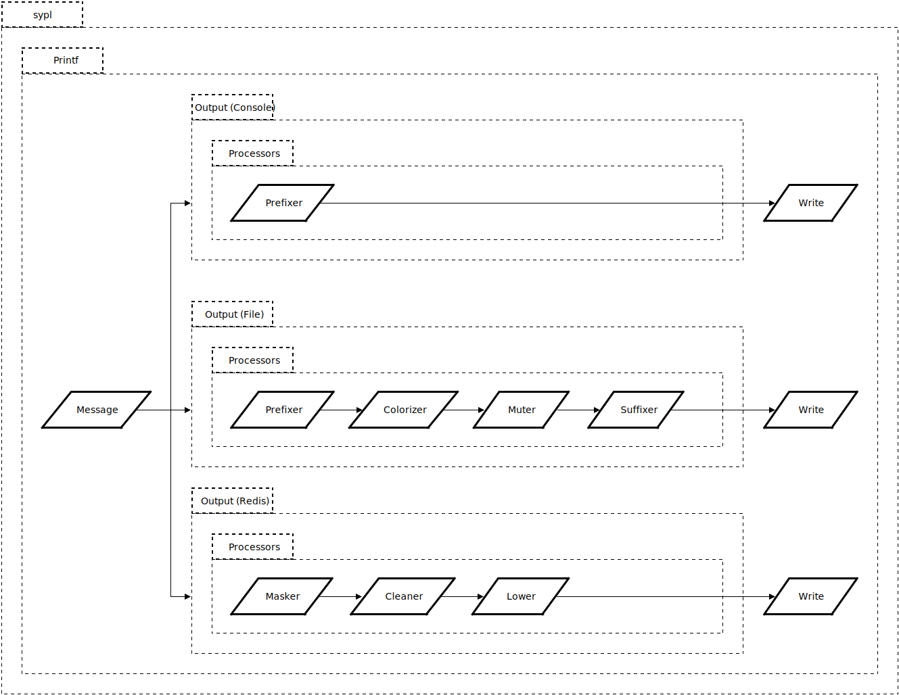

# sypl

`sypl` provides a **S**imple **Y**et **P**owerful **L**ogger built on top of the Golang sypl. A sypl logger can have many `Output`s, and each `Output` is responsible for writing to a specified destination. Each `Output` can have multiple `Processor`s, which run in isolation manipulating the log message. The order of execution is important, and is according to the registering (add) order. These features allow `sypl` to fit into many different logging flows.

## Install

`$ go get github.com/saucelabs/sypl`

### Specific version

Example: `$ go get github.com/saucelabs/sypl@v1.2.0`

## Usage

See [`example_test.go`](example_test.go), and [`sypl_test.go`](sypl_test.go) file.

### Documentation

Run `$ make doc` or check out [online](https://pkg.go.dev/github.com/saucelabs/sypl).

## How it works

A picture worth thousand words.

## Development

Check out [CONTRIBUTION](CONTRIBUTION.md).

### Release

1. Update [CHANGELOG](CHANGELOG.md) accordingly.
2. Once changes from MR are merged.
3. Tag and release.

## Roadmap

Check out [CHANGELOG](CHANGELOG.md).
